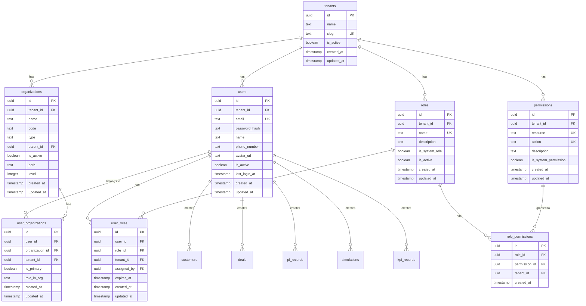

# アカウント管理 ER図・設計ドキュメント

> **最終更新日**: 2024-12-24  
> **バージョン**: 1.0.0

このドキュメントは、アカウント管理機能のデータベース設計とER図を提供します。

## 概要

アカウント管理は、マルチテナント対応のCRMプラットフォームにおいて、以下の機能を提供します：

1. **ユーザーアカウント管理**: テナント内のユーザー（従業員）の管理
2. **ロール・権限管理**: 役割ベースのアクセス制御（RBAC）
3. **組織との紐付け**: ユーザーを組織階層に紐付けて、データアクセス範囲を制御
4. **認証・認可**: ログイン認証とリソースへのアクセス制御

---

## ER図（Mermaid形式）



---

## ER図（テキスト表現）

```
┌─────────────────────────────────────────────────────────────────────────┐
│                        アカウント管理 ER図                                │
└─────────────────────────────────────────────────────────────────────────┘

┌──────────────┐
│   tenants    │  ◄── テナント（企業単位）
│──────────────│
│ id (PK)      │
│ name         │
│ slug (UNIQUE)│
│ is_active    │
│ created_at   │
│ updated_at   │
└──────┬───────┘
       │ 1
       │
       │ N
┌──────▼──────────────────────────────────────────────────────────────┐
│                        users (ユーザーアカウント)                        │
│──────────────────────────────────────────────────────────────────────│
│ id (PK)                                                               │
│ tenant_id (FK → tenants.id) ◄── マルチテナント対応                    │
│ email (UNIQUE within tenant) ◄── ログインID                           │
│ password_hash ◄── ハッシュ化されたパスワード                           │
│ name                                                                  │
│ phone_number                                                          │
│ avatar_url                                                            │
│ is_active                                                             │
│ last_login_at                                                         │
│ created_at                                                            │
│ updated_at                                                            │
└──────┬────────────────────────────────────────────────────────────────┘
       │
       │ N
       │
       │ N
┌──────▼──────────────────────────────────────────────────────────────┐
│              user_organizations (ユーザー-組織紐付け)                   │
│──────────────────────────────────────────────────────────────────────│
│ id (PK)                                                               │
│ user_id (FK → users.id)                                              │
│ organization_id (FK → organizations.id)                               │
│ tenant_id (FK → tenants.id) ◄── パフォーマンス向上のため直接保持      │
│ is_primary ◄── 主所属組織フラグ                                       │
│ role_in_org ◄── 組織内での役割（例: "manager", "member"）            │
│ created_at                                                            │
│ updated_at                                                            │
│                                                                       │
│ UNIQUE(user_id, organization_id)                                      │
└──────┬────────────────────────────────────────────────────────────────┘
       │
       │ N
       │
┌──────▼──────────────┐
│  organizations      │  ◄── 既存テーブル（組織階層）
│────────────────────│
│ id (PK)            │
│ tenant_id (FK)     │
│ name               │
│ code               │
│ type               │
│ parent_id (FK)     │
│ ...                │
└────────────────────┘

┌──────┬──────────────────────────────────────────────────────────────┐
│      │                                                               │
│      │ N                                                             │
│      │                                                               │
┌──────▼──────────────────────────────────────────────────────────────┐
│                        user_roles (ユーザー-ロール紐付け)               │
│──────────────────────────────────────────────────────────────────────│
│ id (PK)                                                               │
│ user_id (FK → users.id)                                              │
│ role_id (FK → roles.id)                                               │
│ tenant_id (FK → tenants.id) ◄── パフォーマンス向上のため直接保持      │
│ assigned_by (FK → users.id) ◄── 誰が割り当てたか                     │
│ expires_at ◄── ロールの有効期限（NULL = 無期限）                     │
│ created_at                                                            │
│ updated_at                                                            │
│                                                                       │
│ UNIQUE(user_id, role_id)                                              │
└──────┬────────────────────────────────────────────────────────────────┘
       │
       │ N
       │
┌──────▼──────────────────────────────────────────────────────────────┐
│                        roles (ロール定義)                              │
│──────────────────────────────────────────────────────────────────────│
│ id (PK)                                                               │
│ tenant_id (FK → tenants.id) ◄── テナント固有のロール                 │
│ name (UNIQUE within tenant) ◄── 例: "admin", "sales_manager"          │
│ description                                                           │
│ is_system_role ◄── システムロール（削除不可）                         │
│ is_active                                                             │
│ created_at                                                            │
│ updated_at                                                            │
└──────┬────────────────────────────────────────────────────────────────┘
       │
       │ 1
       │
       │ N
┌──────▼──────────────────────────────────────────────────────────────┐
│                    role_permissions (ロール-権限紐付け)                 │
│──────────────────────────────────────────────────────────────────────│
│ id (PK)                                                               │
│ role_id (FK → roles.id)                                               │
│ permission_id (FK → permissions.id)                                  │
│ tenant_id (FK → tenants.id) ◄── パフォーマンス向上のため直接保持      │
│ created_at                                                            │
│                                                                       │
│ UNIQUE(role_id, permission_id)                                       │
└──────┬────────────────────────────────────────────────────────────────┘
       │
       │ N
       │
┌──────▼──────────────────────────────────────────────────────────────┐
│                    permissions (権限定義)                              │
│──────────────────────────────────────────────────────────────────────│
│ id (PK)                                                               │
│ tenant_id (FK → tenants.id) ◄── テナント固有の権限                   │
│ resource ◄── リソース名（例: "customers", "deals", "organizations"） │
│ action ◄── アクション（例: "read", "create", "update", "delete"）   │
│ description                                                           │
│ is_system_permission ◄── システム権限（削除不可）                     │
│ created_at                                                            │
│ updated_at                                                            │
│                                                                       │
│ UNIQUE(tenant_id, resource, action)                                  │
└──────────────────────────────────────────────────────────────────────┘

┌──────────────────────────────────────────────────────────────────────┐
│                    既存テーブルとの関係                                 │
└──────────────────────────────────────────────────────────────────────┘

users
  └─► customers (created_by, updated_by) ◄── 作成者・更新者記録
  └─► deals (created_by, updated_by) ◄── 作成者・更新者記録
  └─► pl_records (created_by) ◄── 作成者記録
  └─► simulations (created_by) ◄── 作成者記録
  └─► kpi_records (created_by) ◄── 作成者記録
```

---

## テーブル定義詳細

### 1. users（ユーザーアカウント）

**目的**: テナント内のユーザー（従業員）アカウントを管理

| カラム名 | 型 | 制約 | 説明 |
|---------|-----|------|------|
| id | uuid | PK, DEFAULT random() | ユーザーID |
| tenant_id | uuid | FK → tenants.id, NOT NULL | テナントID |
| email | text | NOT NULL | メールアドレス（ログインID） |
| password_hash | text | NOT NULL | ハッシュ化されたパスワード |
| name | text | NOT NULL | ユーザー名 |
| phone_number | text | | 電話番号 |
| avatar_url | text | | アバター画像URL |
| is_active | boolean | DEFAULT true | 有効フラグ |
| last_login_at | timestamp | | 最終ログイン日時 |
| created_at | timestamp | DEFAULT now() | 作成日時 |
| updated_at | timestamp | DEFAULT now() | 更新日時 |

**インデックス**:
- `idx_users_tenant_email` (tenant_id, email) - UNIQUE制約
- `idx_users_tenant_active` (tenant_id, is_active)

**設計理由**:
- `email` は `tenant_id` と組み合わせてUNIQUE（異なるテナント間で同じメールアドレスを使用可能）
- `password_hash` は bcrypt や argon2 でハッシュ化
- `last_login_at` でセキュリティ監査をサポート

---

### 2. user_organizations（ユーザー-組織紐付け）

**目的**: ユーザーを組織階層に紐付け、データアクセス範囲を制御

| カラム名 | 型 | 制約 | 説明 |
|---------|-----|------|------|
| id | uuid | PK, DEFAULT random() | 紐付けID |
| user_id | uuid | FK → users.id, NOT NULL | ユーザーID |
| organization_id | uuid | FK → organizations.id, NOT NULL | 組織ID |
| tenant_id | uuid | FK → tenants.id, NOT NULL | テナントID（パフォーマンス向上） |
| is_primary | boolean | DEFAULT false | 主所属組織フラグ |
| role_in_org | text | | 組織内での役割（例: "manager", "member"） |
| created_at | timestamp | DEFAULT now() | 作成日時 |
| updated_at | timestamp | DEFAULT now() | 更新日時 |

**制約**:
- UNIQUE(user_id, organization_id) - 同じユーザーを同じ組織に重複登録不可
- 1ユーザーにつき、`is_primary = true` は1件のみ

**設計理由**:
- ユーザーは複数の組織に所属可能（例: 直営と代理店の両方）
- `is_primary` で主所属組織を指定（デフォルトのデータアクセス範囲）
- `role_in_org` で組織内での役割を管理（組織管理者など）

---

### 3. roles（ロール定義）

**目的**: 役割ベースのアクセス制御（RBAC）のロール定義

| カラム名 | 型 | 制約 | 説明 |
|---------|-----|------|------|
| id | uuid | PK, DEFAULT random() | ロールID |
| tenant_id | uuid | FK → tenants.id, NOT NULL | テナントID |
| name | text | NOT NULL | ロール名（例: "admin", "sales_manager"） |
| description | text | | 説明 |
| is_system_role | boolean | DEFAULT false | システムロール（削除不可） |
| is_active | boolean | DEFAULT true | 有効フラグ |
| created_at | timestamp | DEFAULT now() | 作成日時 |
| updated_at | timestamp | DEFAULT now() | 更新日時 |

**インデックス**:
- `idx_roles_tenant_name` (tenant_id, name) - UNIQUE制約

**設計理由**:
- テナントごとに独自のロールを定義可能
- `is_system_role = true` のロールは削除不可（例: "admin", "viewer"）
- ロール名は `tenant_id` と組み合わせてUNIQUE

**標準ロール例**:
- `admin`: 全権限
- `sales_manager`: 営業管理権限
- `sales_rep`: 営業担当者権限
- `viewer`: 閲覧のみ

---

### 4. user_roles（ユーザー-ロール紐付け）

**目的**: ユーザーにロールを割り当て

| カラム名 | 型 | 制約 | 説明 |
|---------|-----|------|------|
| id | uuid | PK, DEFAULT random() | 紐付けID |
| user_id | uuid | FK → users.id, NOT NULL | ユーザーID |
| role_id | uuid | FK → roles.id, NOT NULL | ロールID |
| tenant_id | uuid | FK → tenants.id, NOT NULL | テナントID（パフォーマンス向上） |
| assigned_by | uuid | FK → users.id | 割り当てたユーザーID |
| expires_at | timestamp | | ロールの有効期限（NULL = 無期限） |
| created_at | timestamp | DEFAULT now() | 作成日時 |
| updated_at | timestamp | DEFAULT now() | 更新日時 |

**制約**:
- UNIQUE(user_id, role_id) - 同じユーザーに同じロールを重複割り当て不可

**設計理由**:
- 1ユーザーに複数のロールを割り当て可能（権限の和集合）
- `expires_at` で一時的なロール割り当てをサポート（例: 期間限定の管理者権限）
- `assigned_by` で監査ログをサポート

---

### 5. permissions（権限定義）

**目的**: リソースへのアクション権限を定義

| カラム名 | 型 | 制約 | 説明 |
|---------|-----|------|------|
| id | uuid | PK, DEFAULT random() | 権限ID |
| tenant_id | uuid | FK → tenants.id, NOT NULL | テナントID |
| resource | text | NOT NULL | リソース名（例: "customers", "deals"） |
| action | text | NOT NULL | アクション（例: "read", "create", "update", "delete"） |
| description | text | | 説明 |
| is_system_permission | boolean | DEFAULT false | システム権限（削除不可） |
| created_at | timestamp | DEFAULT now() | 作成日時 |
| updated_at | timestamp | DEFAULT now() | 更新日時 |

**インデックス**:
- `idx_permissions_tenant_resource_action` (tenant_id, resource, action) - UNIQUE制約

**設計理由**:
- `resource` と `action` の組み合わせで権限を定義
- テナントごとに独自の権限を定義可能
- `is_system_permission = true` の権限は削除不可

**標準権限例**:
- `customers:read`, `customers:create`, `customers:update`, `customers:delete`
- `deals:read`, `deals:create`, `deals:update`, `deals:delete`
- `organizations:read`, `organizations:create`, `organizations:update`, `organizations:delete`
- `users:read`, `users:create`, `users:update`, `users:delete`
- `settings:read`, `settings:update`

---

### 6. role_permissions（ロール-権限紐付け）

**目的**: ロールに権限を割り当て

| カラム名 | 型 | 制約 | 説明 |
|---------|-----|------|------|
| id | uuid | PK, DEFAULT random() | 紐付けID |
| role_id | uuid | FK → roles.id, NOT NULL | ロールID |
| permission_id | uuid | FK → permissions.id, NOT NULL | 権限ID |
| tenant_id | uuid | FK → tenants.id, NOT NULL | テナントID（パフォーマンス向上） |
| created_at | timestamp | DEFAULT now() | 作成日時 |

**制約**:
- UNIQUE(role_id, permission_id) - 同じロールに同じ権限を重複割り当て不可

**設計理由**:
- 1ロールに複数の権限を割り当て可能
- ユーザーの権限は、割り当てられたロールの権限の和集合

---

## リレーションシップ

### users
```typescript
{
  tenant: one(tenants),
  organizations: many(userOrganizations),
  roles: many(userRoles),
  createdCustomers: many(customers, { relationName: "createdBy" }),
  updatedCustomers: many(customers, { relationName: "updatedBy" }),
  // ... 他のテーブルとの関係
}
```

### user_organizations
```typescript
{
  user: one(users),
  organization: one(organizations),
  tenant: one(tenants),
}
```

### roles
```typescript
{
  tenant: one(tenants),
  users: many(userRoles),
  permissions: many(rolePermissions),
}
```

### user_roles
```typescript
{
  user: one(users),
  role: one(roles),
  assignedByUser: one(users, { relationName: "assignedBy" }),
  tenant: one(tenants),
}
```

### permissions
```typescript
{
  tenant: one(tenants),
  roles: many(rolePermissions),
}
```

### role_permissions
```typescript
{
  role: one(roles),
  permission: one(permissions),
  tenant: one(tenants),
}
```

---

## アクセス制御の仕組み

### 1. データアクセス範囲の決定

ユーザーのデータアクセス範囲は、以下のルールで決定されます：

1. **テナント分離**: ユーザーは自分のテナントのデータのみアクセス可能
2. **組織階層**: ユーザーの主所属組織（`is_primary = true`）とその配下組織のデータにアクセス可能
3. **権限チェック**: リソースへのアクション（read/create/update/delete）は、ユーザーのロールに含まれる権限で判定

### 2. 権限チェックのクエリ例

```sql
-- ユーザーが customers:read 権限を持っているかチェック
SELECT EXISTS(
  SELECT 1
  FROM user_roles ur
  INNER JOIN role_permissions rp ON ur.role_id = rp.role_id
  INNER JOIN permissions p ON rp.permission_id = p.id
  WHERE ur.user_id = $1
    AND ur.tenant_id = $2
    AND (ur.expires_at IS NULL OR ur.expires_at > NOW())
    AND p.resource = 'customers'
    AND p.action = 'read'
);
```

### 3. データアクセス範囲のクエリ例

```sql
-- ユーザーがアクセス可能な顧客一覧を取得
SELECT c.*
FROM customers c
INNER JOIN user_organizations uo ON c.organization_id = uo.organization_id
INNER JOIN organization_closure oc ON c.organization_id = oc.descendant_id
WHERE uo.user_id = $1
  AND uo.tenant_id = $2
  AND uo.is_primary = true
  AND oc.ancestor_id = uo.organization_id
  AND c.tenant_id = $2;
```

---

## インデックス戦略

### パフォーマンス最適化のためのインデックス

```sql
-- users
CREATE INDEX idx_users_tenant_email ON users(tenant_id, email);
CREATE INDEX idx_users_tenant_active ON users(tenant_id, is_active);

-- user_organizations
CREATE INDEX idx_user_orgs_user ON user_organizations(user_id);
CREATE INDEX idx_user_orgs_org ON user_organizations(organization_id);
CREATE INDEX idx_user_orgs_tenant ON user_orgs(tenant_id);
CREATE INDEX idx_user_orgs_primary ON user_organizations(user_id, is_primary) WHERE is_primary = true;

-- user_roles
CREATE INDEX idx_user_roles_user ON user_roles(user_id);
CREATE INDEX idx_user_roles_role ON user_roles(role_id);
CREATE INDEX idx_user_roles_tenant ON user_roles(tenant_id);
CREATE INDEX idx_user_roles_expires ON user_roles(user_id, expires_at) WHERE expires_at IS NOT NULL;

-- role_permissions
CREATE INDEX idx_role_perms_role ON role_permissions(role_id);
CREATE INDEX idx_role_perms_permission ON role_permissions(permission_id);
CREATE INDEX idx_role_perms_tenant ON role_permissions(tenant_id);

-- permissions
CREATE INDEX idx_permissions_tenant_resource ON permissions(tenant_id, resource);
```

---

## 既存テーブルへの影響

### 作成者・更新者記録の追加

以下のテーブルに `created_by` と `updated_by` カラムを追加する必要があります：

- `customers`: `created_by`, `updated_by` (FK → users.id)
- `deals`: `created_by`, `updated_by` (FK → users.id)
- `pl_records`: `created_by` (FK → users.id)
- `simulations`: `created_by` (FK → users.id)
- `kpi_records`: `created_by` (FK → users.id)

**注意**: これらのカラムは NULL を許可（既存データとの互換性のため）

---

## 実装の優先順位

### Phase 1: 基本アカウント管理
1. ✅ `users` テーブルの作成
2. ✅ `user_organizations` テーブルの作成
3. ✅ 認証機能（ログイン/ログアウト）
4. ✅ ユーザー一覧・詳細画面
5. ✅ ユーザー作成・編集・削除画面

### Phase 2: ロール・権限管理
1. ✅ `roles` テーブルの作成
2. ✅ `permissions` テーブルの作成
3. ✅ `user_roles` テーブルの作成
4. ✅ `role_permissions` テーブルの作成
5. ✅ ロール管理画面
6. ✅ 権限管理画面
7. ✅ アクセス制御ミドルウェアの実装

### Phase 3: データアクセス制御
1. ✅ 組織階層に基づくデータアクセス範囲の実装
2. ✅ 権限チェック機能の実装
3. ✅ 作成者・更新者記録の追加

---

## セキュリティ考慮事項

### 1. パスワード管理
- bcrypt または argon2 を使用してハッシュ化
- パスワード強度チェック（最低8文字、大文字・小文字・数字・記号を含む）
- パスワードリセット機能（トークンベース）

### 2. セッション管理
- JWT またはセッションストアを使用
- セッションタイムアウト（例: 30分）
- ログアウト時のセッション無効化

### 3. 監査ログ
- ユーザーの作成・更新・削除を記録
- ロール割り当ての変更を記録
- ログイン・ログアウトを記録

---

## 参考資料

- [RBAC (Role-Based Access Control)](https://en.wikipedia.org/wiki/Role-based_access_control)
- [PostgreSQL Row Level Security](https://www.postgresql.org/docs/current/ddl-rowsecurity.html)
- [OWASP Authentication Cheat Sheet](https://cheatsheetseries.owasp.org/cheatsheets/Authentication_Cheat_Sheet.html)

